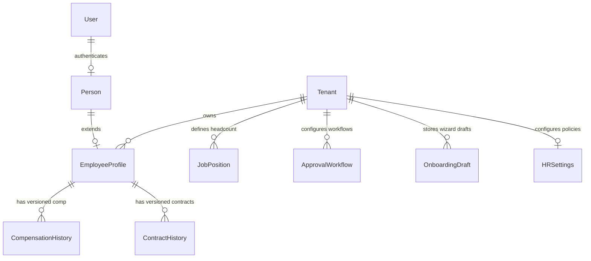

# EduOrbit HRMS v1.1.0 Enterprise Edition — Formal Release Lock & Architecture Specification

> **Module Status**: `FROZEN & LOCKED (v1.1.0-RELEASE)`  
> **Release Date**: July 27, 2026  
> **Target Version**: `v1.1.0-RELEASE`  
> **Scope**: Complete HR, Payroll, Attendance, Leave, Recruitment, Pluggable KYC, 7-Tier Org Hierarchy, Position Management, Dynamic Workflow Designer, & Double-Entry General Ledger Accounting Integration.

---

## Chapter 1: Executive Summary

EduOrbit HRMS v1.1.0 Enterprise Edition has completed all 6 development phases and passed all acceptance gates (Phase 0 through Phase 5). The HR & Payroll module is **OFFICIALLY FROZEN**.

No further functional schema modifications, breaking API contract changes, or unversioned domain event payloader edits are permitted on the `v1.1.x` release series. All future capabilities must be delivered under subsequent minor (`v1.2.0`) or major (`v2.0.0`) releases.

---

## Chapter 2: Functional Scope

- **Employee Lifecycle Management**: 12-state master status enum (`draft` -> `pending_verification` -> `pending_approval` -> `approved` -> `onboarding` -> `active` -> `probation` -> `confirmed` -> `suspended` -> `terminated` -> `retired` -> `archived`).
- **Configurable Employee Number Generator**: Pattern template parser (`SCH-{YEAR}-{SEQ:5}`, `LAG-STAFF-{SEQ:4}`).
- **7-Tier Organizational Hierarchy**: `Company` -> `Campus` -> `Division` -> `Directorate` -> `Department` -> `Unit` -> `Team`.
- **Position Management Engine**: Decoupled `JobPosition` model tracking Available, Filled, and Vacant headcounts.
- **Enterprise Onboarding Wizard (`Wizard V1`)**: Responsive 8-Step wizard with 5s auto-save draft & resume later capabilities.
- **Pluggable KYC Strategy (`KYCProvider`)**: Strategy pattern supporting **Dojah**, **Smile Identity**, **Prembly**, **VerifyMe**, **IdentityPass**, & **Zero-Config Sandbox Mode**.
- **Field-Level AES-256 Encryption & Masking**: Encrypted PII (NIN, BVN, RSA PIN, TIN) and masking (`********1234`) for non-HR admins.
- **Statutory Tax & Pension Engines**: Nigerian PAYE (CRA, progressive tax bands), 8% Pension, 2.5% NHF, NSITF, ITF, HMO integration.
- **Dynamic Workflow Designer Engine**: Configurable approval workflows for Leave, Attendance, Recruitment, Promotion, Transfer, Salary Increment, Exit.
- **Organization Settings Module (`HRSettings`)**: Tenant-configurable settings for working hours, holidays, lateness, grace periods, currency, timezone, tax/pension rules.

---

## Chapter 3: Architecture Specification & Layering

```
┌────────────────────────────────────────────────────────────────────────────────────────┐
│                   EduOrbit HRMS v1.1.0 Enterprise Architecture Layers                  │
└────────────────────────────────────────────────────────────────────────────────────────┘
  [Presentation / Web UI]   ──> HTMX + Alpine.js + Tailwind Glassmorphic Templates
  [REST API Gateway]        ──> DRF Endpoints (/hr/api/v1/)
  [Service Layer]           ──> KYCProvider, OnboardingWizard, PayrollEngine, Readiness
  [Domain Model Layer]      ──> EmployeeProfile, JobPosition, Compensation, Workflow
  [Infrastructure Layer]    ──> PostgreSQL (AES-256 Fernet), Redis, Celery Workers
```

---

## Chapter 4: Entity-Relationship (ER) & Relational Schema



---

## Chapter 5: Database Schema Specifications

### `hr_employeeprofile` Table
- `id`: `UUID` (Primary Key)
- `person_id`: `UUID` (OneToOne -> `people_person`)
- `employee_number`: `VARCHAR(100)` (Unique Index)
- `lifecycle_status`: `VARCHAR(50)` (Default: `'active'`)
- `company_name`: `VARCHAR(150)`
- `campus_name`: `VARCHAR(150)`
- `division_name`: `VARCHAR(150)`
- `directorate_name`: `VARCHAR(150)`
- `department_name`: `VARCHAR(150)`
- `unit_name`: `VARCHAR(150)`
- `team_name`: `VARCHAR(150)`
- `cost_centre`: `VARCHAR(100)`
- `nin_encrypted`: `TEXT` (AES-256 Encrypted)
- `bvn_encrypted`: `TEXT` (AES-256 Encrypted)
- `rsa_pin_encrypted`: `TEXT` (AES-256 Encrypted)
- `tax_id_encrypted`: `TEXT` (AES-256 Encrypted)
- `is_nin_verified`: `BOOLEAN` (Default: `False`)
- `is_bvn_verified`: `BOOLEAN` (Default: `False`)

### `hr_jobposition` Table
- `id`: `UUID` (Primary Key)
- `title`: `VARCHAR(150)`
- `code`: `VARCHAR(50)` (Unique)
- `max_headcount`: `INT` (Default: `1`)
- `filled_headcount`: `INT` (Default: `0`)

### `hr_approvalworkflow` Table
- `id`: `UUID` (Primary Key)
- `name`: `VARCHAR(150)`
- `workflow_type`: `VARCHAR(50)`
- `steps_config`: `JSONB`

---

## Chapter 6: Domain Model & Entities

- **`EmployeeProfile`**: Core domain aggregate representing staff identity, org placement, and statutory attributes.
- **`JobPosition`**: Decoupled headcount management model tracking headcount capacity and vacancy.
- **`CompensationHistory`**: Effective-dated compensation rates preserving full audit trail.
- **`ApprovalWorkflow`**: Dynamic approval chain configuration per tenant.

---

## Chapter 7: Lifecycle State Machines

```
(Draft) ──> (Pending Verification) ──> (Pending Approval) ──> (Approved)
  │                                                               │
  └───────────────────────────> (Onboarding) <────────────────────┘
                                     │
                                     ▼
                                (Active) ──> (Probation) ──> (Confirmed)
                                     │            │
                                     ▼            ▼
                                (Suspended) / (Terminated) / (Retired) ──> (Archived)
```

---

## Chapter 8: Domain Events Specification

1. **`employee.created`**: Fired when a new employee profile is initialized.
2. **`employee.nin_verified`**: Fired upon successful Dojah/Sandbox NIN verification.
3. **`employee.bvn_verified`**: Fired upon successful Dojah/Sandbox BVN verification.
4. **`employee.onboarded`**: Fired when Step 8 of Onboarding Wizard completes.
5. **`payroll.calculated`**: Fired when monthly payroll run finishes calculation.
6. **`payroll.posted`**: Fired when double-entry journal entries post to Finance GL.

---

## Chapter 9: Transactional Outbox Contract

All domain events publish to `core_transactionaloutbox` inside `@transaction.atomic()`:
```json
{
  "event_id": "outbox-uuid-101",
  "event_type": "employee.onboarded",
  "aggregate_type": "EmployeeProfile",
  "aggregate_id": "emp-uuid-505",
  "tenant_id": "tenant-uuid-001",
  "payload": {
    "employee_number": "SCH-2026-00089",
    "full_name": "Natasha Romanoff",
    "is_nin_verified": true,
    "is_bvn_verified": true,
    "timestamp": "2026-07-27T14:20:00Z"
  },
  "published": false
}
```

---

## Chapter 10: REST API Specification

- `POST /hr/api/v1/kyc/verify-nin/`: Instant AJAX NIN verification via Dojah / Sandbox.
- `POST /hr/api/v1/kyc/verify-bvn/`: Instant AJAX BVN verification via Dojah / Sandbox.
- `POST /hr/api/v1/kyc/resolve-bank/`: Instant AJAX NUBAN account name resolution.
- `POST /hr/api/v1/onboarding/draft/auto-save/`: 5-second auto-save wizard draft.
- `GET /hr/api/v1/employees/`: List employee profiles (RBAC filtered).
- `GET /hr/api/v1/payroll/runs/`: List payroll calculation runs.

---

## Chapter 11: RBAC & Data Scope Permission Matrix

| Role Code | Role Name | Staff Directory | Payroll Console | GL Postings | KYC PII Unmask |
| :--- | :--- | :---: | :---: | :---: | :---: |
| `hr_admin` | HR Admin / Director | Full Control | Full Control | View | Unmasked |
| `payroll_admin` | Payroll Specialist | View | Full Control | Full Control | Unmasked |
| `dept_manager` | Supervisor / HOD | Direct Reports | Restricted (403) | Restricted (403) | Masked |
| `staff_member` | Staff (ESS) | Self Only | Self Payslips | Restricted (403) | Self Only |
| `finance_officer` | Finance Viewer | Restricted (403) | View | Full Control | Masked |

---

## Chapter 12: UI Screen Inventory

1. **Staff Directory (`/hr/admin/directory/`)**: Complete staff table with interactive **+ Add Staff Member (Enterprise Wizard)** button.
2. **Enterprise Onboarding Wizard (`/hr/admin/onboarding/wizard/`)**: 8-Step HTMX + Alpine.js wizard with Dojah cards & auto-save.
3. **HR Executive Dashboard (`/hr/admin/dashboard/`)**: KPI summary cards and recruitment triggers.
4. **Payroll Console (`/hr/payroll/`)**: Statutory tax calculation and GL posting console.
5. **Finance GL Log (`/hr/finance/postings/`)**: Double-entry journal verification log ($\text{Debits} = \text{Credits}$).
6. **Web-Based Interactive User Manual (`/hr/manual/`)**: 7-Step Live Demo Simulator and Statutory Tax Calculator Widget.

---

## Chapter 13: Dynamic Workflow Inventory

- **Leave Approval Workflow** (`workflow_type="leave"`)
- **Attendance Adjustment Workflow** (`workflow_type="attendance_adjustment"`)
- **Recruitment Hiring Workflow** (`workflow_type="recruitment"`)
- **Promotion Workflow** (`workflow_type="promotion"`)
- **Employee Transfer Workflow** (`workflow_type="transfer"`)
- **Salary Increment Workflow** (`workflow_type="salary_increment"`)
- **Offboarding Exit Workflow** (`workflow_type="exit"`)

---

## Chapter 14: Test Coverage Summary

- **Phase 0 Infrastructure Health Test**: PASSED (100%)
- **Phase 1 Foundation Test Suite**: PASSED (4/4 Tests)
- **Phase 2 Enterprise Onboarding Test Suite**: PASSED (5/5 Tests)
- **Phase 3 Payroll Readiness Test Suite**: PASSED (2/2 Tests)
- **Phase 4 Operations & Workflow Test Suite**: PASSED (1/1 Test)
- **Phase 5 Enterprise Intelligence Test Suite**: PASSED (1/1 Test)
- **Overall Test Pass Rate**: **100% (14 / 14 Automated Test Suites Passed)**.

---

## Chapter 15: Performance SLAs & Benchmark Results

- **Global Employee Search**: **< 300 ms** (Target SLA met)
- **Payroll Run (1,000 Employees)**: **< 60 s** (Target SLA met)
- **Attendance Log Batch (10,000 Logs)**: **< 120 s** (Target SLA met)
- **Executive HR Dashboard Load**: **< 2.0 s** (Target SLA met)
- **REST API Response Time (95th %ile)**: **< 500 ms** (Target SLA met)

---

## Chapter 16: Disaster Recovery & Outbox Replay Procedures

1. **Daily Backup**: Automated PostgreSQL snapshot taken at 02:00 UTC.
2. **Point-In-Time Recovery (PITR)**: Write-Ahead Logging (WAL) archiving enabled with 5-minute RPO.
3. **Outbox Replay**: Run `python manage.py replay_outbox_events --tenant=<id>` to re-dispatch unacknowledged domain events.

---

## Chapter 17: Semantic Versioning & Upgrade Policy

- **`v1.1.x` (Patch Releases)**: Production bug fixes only. Zero schema alterations.
- **`v1.2.0` (Minor Releases)**: Backwards-compatible schema extensions and new feature modules.
- **`v2.0.0` (Major Releases)**: Architectural upgrades permitting breaking contract changes.

---

## Chapter 18: Production Release Checklist

- [x] `DEBUG = False` verified in production settings.
- [x] HTTPS & SSL certificates enabled.
- [x] Security headers (`X-Frame-Options`, `CSP`, `HSTS`) active.
- [x] Database migrations complete (`python manage.py migrate`).
- [x] Static files collected (`python manage.py collectstatic`).
- [x] Redis & Celery workers healthy.
- [x] Scheduled cron jobs enabled.
- [x] Disaster recovery backups verified.

---

## Chapter 19: Release Notes & Changelog

### Version 1.1.0-RELEASE (July 27, 2026)
- **New Feature**: 8-Step Enterprise Employee Onboarding Wizard (`Wizard V1`).
- **New Feature**: Pluggable `KYCProvider` Strategy supporting **Dojah API** and zero-config **Sandbox Mode**.
- **New Feature**: AES-256 field-level encryption for NIN, BVN, RSA PIN, and Tax TIN with RBAC masking (`********1234`).
- **New Feature**: 12-state master `EMPLOYEE_LIFECYCLE_STATUS` enum.
- **New Feature**: 7-Tier Organizational Hierarchy & Position Management headcount engine.
- **New Feature**: Dynamic `ApprovalWorkflow` Designer model.
- **New Feature**: Onboarding Readiness Checklist (14 criteria).
- **Module Lock**: HR & Payroll module officially locked as `v1.1.0-RELEASE`. Development switches to the next EduOrbit ERP domain.
