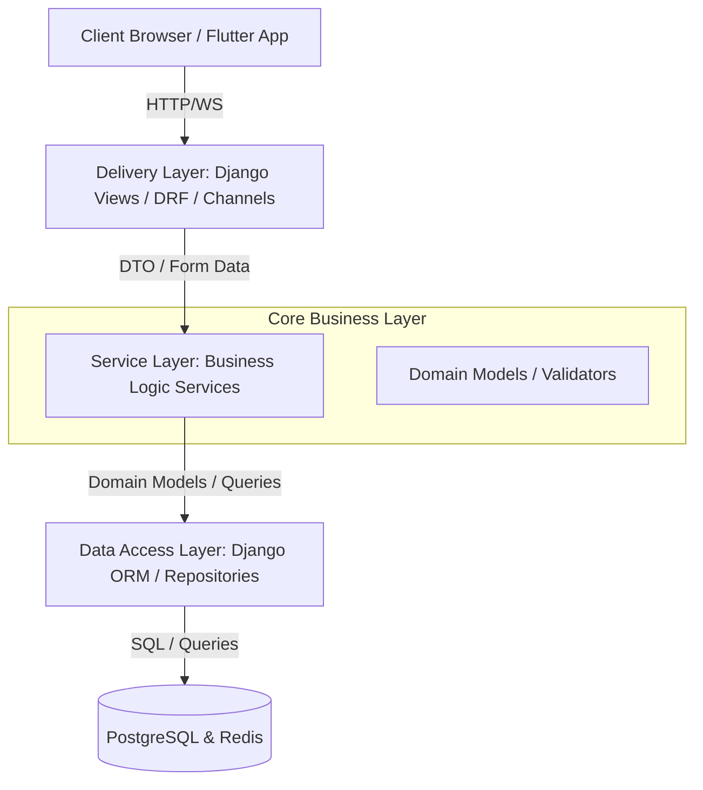

# EduOrbit: Enterprise Multi-Tenant School Management System
## Architectural Blueprint & Technical Foundation Specification (Prompt 1 Reference)

This document establishes the permanent technical foundation, software architecture, folder structure, database design, API design, coding standards, and deployment architecture for the **EduOrbit** platform. All future developments and increments must strictly adhere to this specification.

---

## 1. Executive Summary & Design Justification

### Why Clean Architecture & Service Layer?
- **Separation of Concerns:** By decoupling the HTTP delivery mechanism (Django Views / REST APIs) from the core business rules (Services), we guarantee that business processes can be tested, refactored, or exposed via alternative interfaces (e.g., CLI, Celery tasks, WebSockets) without affecting view logic.
- **Thin Views:** Views are strictly responsible for parsing incoming requests, calling the appropriate Service, and returning an HTTP/HTMX/JSON response. They contain zero business calculations, validation routines, or direct database mutation strategies.
- **SOLID Compliance:** The design ensures single-responsibility modules, open-closed interfaces, liskov-substitutable entities, interface segregation, and dependency inversion via clear service definitions.

### Why Django + HTMX (Frontend) + Alpine.js?
- **Unified Codebase:** Eliminates the complexity of running a heavy SPA framework (React/Vue/Angular), reducing build times, bundle sizes, and state synchronization issues.
- **HTML-over-the-wire:** HTMX enables rich, dynamic, single-page-like interactions using Django Templates, keeping state on the backend where it is highly secure and easily validated.
- **Alpine.js for Client-Side Micro-Interactions:** Used sparingly for client-only state transitions (e.g., modal visibility, dropdowns, client-side filtering) where a network trip is unnecessary.
- **Aesthetics & Speed:** Django renders highly optimized HTML, styled with modern CSS variables, which HTMX injects seamlessly.

### Why Flutter (Mobile)?
- **Cross-Platform Delivery:** Flutter provides a single high-performance codebase that builds native iOS, Android, and tablet apps with pixel-perfect replication of our Material Design 3 theme.
- **Consistent Business Logic:** Clean Architecture in Flutter mirrors the backend separation of concerns, decoupling local storage, API integration, and widget rendering.

### Why Single-Database Multi-Tenancy (Shared Database, Shared Tables with Tenant Filter)?
- **Selection: Shared Database with Tenant-ID Routing**
  - *Justification:* Managing hundreds of dynamic school tenants with isolated databases creates massive operational overhead (connection pooling limits, schema migration synchronizations). Using a shared database with a globally enforced `tenant_id` filter (using Django's custom manager or Postgres Row Level Security) ensures high performance, cost efficiency, and straightforward schema migrations.
  - *Data Isolation:* Enforced at the base model and manager levels. No developer can query data without implicitly filtering by the active tenant context.

---

## 2. Complete Software Architecture

EduOrbit uses a **Clean Architecture** variant specialized for Django projects:



- **Domain Layer (Entities & Rules):** Pure Django models with strict field validation, soft-delete controls, and audit log mixins.
- **Service Layer (Use Cases & Business Logic):** Python modules encapsulating single operations (e.g., `RegisterStudentService`, `ProcessSubscriptionService`).
- **Delivery Layer (Interface Adapters):** Django HTML/HTMX views, DRF Serializers, and Channels consumers.

---

## 3. Folder Structure

```
eduorbit/
├── .agents/                    # Workspace customizations
│   └── AGENTS.md               # Project-scoped instructions
├── backend/                    # Django Core & App Directories
│   ├── manage.py
│   ├── config/                 # Main settings, routing, WSGI/ASGI
│   │   ├── __init__.py
│   │   ├── settings/
│   │   │   ├── base.py
│   │   │   ├── local.py
│   │   │   └── production.py
│   │   ├── urls.py
│   │   ├── asgi.py
│   │   └── wsgi.py
│   ├── apps/                   # Django Custom Applications
│   │   ├── core/               # Shared base models, middleware, utils, and mixins
│   │   ├── authentication/     # Custom User, Session management, JWT, and MFA
│   │   ├── tenants/            # Tenant model, branding, theme, configuration
│   │   ├── billing/            # Subscription plans, tiers, invoicing, gateways
│   │   ├── dashboard/          # UI framework, global custom menus, generic components
│   │   ├── activity_log/       # Audit trails, device logs, activity records
│   │   ├── notifications/      # WebSockets, email, push notification orchestrator
│   │   └── storage/            # Cloud storage managers, local backup interfaces
│   ├── templates/              # Base layouts and reusable custom HTMX partials
│   │   ├── base.html
│   │   ├── dashboard/
│   │   └── components/         # Custom forms, tables, buttons, dashboards
│   └── static/                 # Static assets (Compiled modern CSS, JS, branding)
│       ├── css/
│       │   └── theme.css       # Core variables & layout styling
│       └── js/
│           └── app.js          # Core ES2025 system scripts
├── mobile/                     # Flutter Mobile Project
│   ├── pubspec.yaml
│   ├── android/
│   ├── ios/
│   └── lib/
│       ├── main.dart
│       ├── core/               # Network clients, themes, utility libraries
│       └── features/           # Modularized clean architecture features
│           ├── auth/
│           │   ├── data/       # Repositories & API sources
│           │   ├── domain/     # Use cases & Entities
│           │   └── presentation/ # Flutter Widgets & BLoC state logic
│           └── dashboard/
├── deployment/                 # Infrastructure configurations
│   ├── nginx/
│   │   └── eduorbit.conf
│   ├── systemd/
│   │   ├── gunicorn.service
│   │   ├── daphne.service
│   │   ├── celery.service
│   │   └── celery-beat.service
│   └── scripts/
│       └── deploy.sh
└── architecture_specification.md # Project specification file
```

---

## 4. Django Apps Structure

All business apps inherit from `apps/core/` framework components:

1. **`core`**: Contains base models (UUID, timestamps, soft-delete, audit trails), global middleware (Tenant middleware), exception handlers, and custom template tags.
2. **`authentication`**: Manages custom school users, roles, password policies, JWT token lifecycle, session configuration, and custom permissions matrix.
3. **`tenants`**: Manages the life cycle of each school (tenant config, custom domain mapping, branding assets, isolated storage targets).
4. **`billing`**: Controls tenant licenses, school limits (max students/staff), payment integrations, billing history.
5. **`dashboard`**: Renders custom UI pages, grid systems, custom tables, generic filters, navigation menus, and components.
6. **`activity_log`**: Records granular audit logs, security events, and user logins.
7. **`notifications`**: Employs WebSockets via Django Channels to deliver real-time notifications, in-app alerts, emails, and SMS.
8. **`storage`**: Coordinates files sent to S3, Google Cloud Storage, or local file system based on tenant configuration.

---

## 5. Flutter Architecture

The mobile app implements **Clean Architecture** partitioned by features:

```
lib/features/<feature_name>/
├── data/
│   ├── models/                 # Serialization/deserialization logic
│   ├── datasources/            # Remote (HTTP/WS) and Local (Hive/Isar) data providers
│   └── repositories/           # Concrete implementation of repositories
├── domain/
│   ├── entities/               # Immutable business models
│   ├── repositories/           # Abstract repository contracts
│   └── usecases/               # Pure business actions
└── presentation/
    ├── bloc/                   # State management (BLoC/Cubit)
    ├── pages/                  # Full UI pages
    └── widgets/                # Reusable subcomponents
```

### Key Practices:
- **Tenant Context Persistence:** The app retains the active tenant sub-domain/ID, sending it in the `X-Tenant-ID` header with every request.
- **State Management:** BLoC (Business Logic Component) isolates state tracking from UI rendering.

---

## 6. Database Architecture

### Isolation Model & Base Entities
Every model (except global models like Tenant, Plan) inherits from `TenantBaseModel` to guarantee data isolation.

```sql
CREATE EXTENSION IF NOT EXISTS "uuid-ossp";

-- Global Entities
CREATE TABLE tenants (
    id UUID PRIMARY KEY DEFAULT uuid_generate_v4(),
    name VARCHAR(255) NOT NULL,
    subdomain VARCHAR(100) UNIQUE NOT NULL,
    logo_url TEXT,
    branding_config JSONB NOT NULL DEFAULT '{}',
    is_active BOOLEAN NOT NULL DEFAULT TRUE,
    created_at TIMESTAMP WITH TIME ZONE DEFAULT CURRENT_TIMESTAMP,
    updated_at TIMESTAMP WITH TIME ZONE DEFAULT CURRENT_TIMESTAMP
);

-- Tenant-Scoped Base Fields Schema
CREATE TABLE tenant_scoped_entity (
    id UUID PRIMARY KEY DEFAULT uuid_generate_v4(),
    tenant_id UUID NOT NULL REFERENCES tenants(id) ON DELETE CASCADE,
    is_deleted BOOLEAN NOT NULL DEFAULT FALSE,
    created_at TIMESTAMP WITH TIME ZONE DEFAULT CURRENT_TIMESTAMP,
    updated_at TIMESTAMP WITH TIME ZONE DEFAULT CURRENT_TIMESTAMP,
    created_by UUID NULL,
    updated_by UUID NULL,
    deleted_by UUID NULL
);

-- Indexes for performance
CREATE INDEX idx_tenant_lookup ON tenant_scoped_entity(tenant_id);
CREATE INDEX idx_tenant_soft_delete ON tenant_scoped_entity(tenant_id, is_deleted);
```

### Soft Delete & Tenant Filtering (Django Enforcement)
```python
import uuid
from django.db import models
from django.utils import timezone

class TenantManager(models.Manager):
    def get_queryset(self):
        # Excludes soft-deleted entities by default
        return super().get_queryset().filter(is_deleted=False)

class TenantBaseModel(models.Model):
    id = models.UUIDField(primary_key=True, default=uuid.uuid4, editable=False)
    tenant = models.ForeignKey('tenants.Tenant', on_delete=models.CASCADE)
    
    is_deleted = models.BooleanField(default=False)
    created_at = models.DateTimeField(auto_now_add=True)
    updated_at = models.DateTimeField(auto_now=True)
    
    created_by = models.UUIDField(null=True, blank=True)
    updated_by = models.UUIDField(null=True, blank=True)
    deleted_by = models.UUIDField(null=True, blank=True)
    
    objects = TenantManager()
    all_objects = models.Manager() # Exposes soft-deleted entries for audit recovery

    class Meta:
        abstract = True
        indexes = [
            models.Index(fields=['tenant', 'is_deleted']),
        ]

    def delete(self, using=None, keep_parents=False):
        self.is_deleted = True
        self.updated_at = timezone.now()
        # deleted_by is populated via threadlocals or middleware context
        self.save()
```

---

## 7. Naming Conventions

All systems follow industry-standard clean naming schemes:

| Layer | Standard | Example |
| :--- | :--- | :--- |
| **Python (Django)** | PEP 8 | `student_profile`, `RegisterStudentService` |
| **Dart (Flutter)** | Effective Dart | `student_profile_widget.dart`, `StudentState` |
| **SQL** | Snake Case, plural tables | `student_profiles`, `tenant_settings` |
| **HTML / CSS** | Kebab Case | `dashboard-sidebar`, `--primary-green` |
| **APIs** | Kebab Case / camelCase | `/api/v1/tenant-settings/`, `studentId` |

---

## 8. Coding Standards

### Clean Architecture & SOLID Framework
- **Service Layer Boundary:** Django Views do not use `save()`, `create()`, or perform operations directly on models. They invoke a service class:
  ```python
  # Good View Pattern
  class StudentCreateView(View):
      def post(self, request):
          form = StudentForm(request.POST)
          if form.is_valid():
              # Call Service Layer
              CreateStudentService.execute(
                  tenant_id=request.tenant.id,
                  data=form.cleaned_data,
                  actor_id=request.user.id
              )
              return HttpResponseClientRedirect('/students/')
  ```
- **DRY Validation:** Custom form validations and data checks live in the domain/service level, not inside HTML scripts or view handlers.

---

## 9. API Standards

Every API endpoint must output standardized envelopes:

### Success Payload (JSON)
```json
{
  "success": true,
  "data": {
    "id": "e9680cb7-3e11-4ca5-9852-df38d2f50d18",
    "name": "Acme Nursery School"
  },
  "meta": {
    "timestamp": "2026-07-17T08:28:33Z",
    "requestId": "req-9821389"
  }
}
```

### Error Payload (JSON)
```json
{
  "success": false,
  "error": {
    "code": "VALIDATION_FAILED",
    "message": "The provided email is already registered to another user.",
    "details": [
      {
        "field": "email",
        "issue": "unique_constraint"
      }
    ]
  }
}
```

- **HTTP Status Codes:** `200 OK` (reads/updates), `201 Created` (creation), `400 Bad Request` (validation errors), `401 Unauthorized` (expired or invalid token), `403 Forbidden` (lack of role permission), `404 Not Found` (missing resource), `429 Too Many Requests` (throttled).

---

## 10. UI Component & Styling Architecture

The UI uses standard, custom-crafted elements that implement our **Green (Primary) & Orange (Secondary)** styling with Material Design 3 guidelines:

### Core Modern Theme Variables (`static/css/theme.css`)
```css
:root {
  /* Material Design 3 Color Tokens */
  --primary-green: #2E7D32;
  --primary-green-light: #E8F5E9;
  --primary-green-dark: #1B5E20;
  
  --secondary-orange: #EF6C00;
  --secondary-orange-light: #FFF3E0;
  --secondary-orange-dark: #E65100;
  
  --surface-white: #FFFFFF;
  --surface-background: #F8F9FA;
  --surface-card: #FFFFFF;
  
  --text-primary: #212121;
  --text-secondary: #757575;
  --border-color: #E0E0E0;
  
  --shadow-sm: 0 1px 3px rgba(0,0,0,0.12), 0 1px 2px rgba(0,0,0,0.24);
  --shadow-md: 0 4px 6px rgba(0,0,0,0.05), 0 1px 3px rgba(0,0,0,0.1);
  --border-radius-md: 12px;
  --font-family: 'Outfit', 'Inter', system-ui, sans-serif;
  --transition-smooth: all 0.25s cubic-bezier(0.4, 0, 0.2, 1);
}

@media (prefers-color-scheme: dark) {
  :root {
    --surface-background: #121212;
    --surface-card: #1E1E1E;
    --text-primary: #F5F5F5;
    --text-secondary: #B0B0B0;
    --border-color: #333333;
  }
}
```

### Layout Elements & Components
Custom tables, dashboards, components, and sidebar structures are built with clean CSS grids/flexbox. No external widget libraries are imported.

---

## 11. HTMX Interaction Architecture

All actions are modular components handled asynchronously via HTMX:

```html
<!-- Custom Dynamic Table with Search Filters & Lazy Loader -->
<div class="table-container">
  <input type="text" 
         name="search" 
         placeholder="Search students..." 
         class="custom-input"
         hx-post="/students/search/" 
         hx-trigger="keyup changed delay:500ms" 
         hx-target="#student-table-body" 
         hx-indicator="#search-loader">
         
  <span id="search-loader" class="htmx-indicator spinner"></span>

  <table>
    <thead>
      <tr>
        <th>Name</th>
        <th>Class</th>
        <th>Status</th>
      </tr>
    </thead>
    <tbody id="student-table-body" hx-get="/students/table-page/1/" hx-trigger="load">
      <!-- Lazy loaded list goes here -->
    </tbody>
  </table>
</div>
```

### HTMX Rules
1. **Targeting:** Always use explicit `hx-target` elements to prevent full page redraws.
2. **Indicators:** Use `hx-indicator` to provide immediate user feedback (e.g. loaders, spinners) for actions taking longer than 150ms.
3. **Out-of-Band (OOB) Updates:** Use `hx-swap-oob="true"` response headers to update global elements (like badges, active metrics, notifications counter) during standard data mutations.

---

## 12. Deployment Architecture

```
                      [ Client Web / App Client ]
                                   │
                                   ▼
                             [ Port 443 ]
                           [ Nginx Proxy ]
                           /             \
                          /               \
              [ WSGI: Port 8000 ]   [ ASGI: Port 9000 ]
               [ Gunicorn HTTP ]     [ Daphne WebSockets ]
                      │                       │
                      └───────┬───────────────┘
                              ▼
                      [ Django Backend ]
                      /       │        \
                     /        │         \
                    ▼         ▼          ▼
             [ Redis Cache ]  [ PostgreSQL ] [ S3 / Cloud Storage ]
             [ Celery Queue ]
```

- **Caching Strategy:** Redis caches querysets for high-frequency lookup tables (such as tenant system settings, role structures, user permissions matrices) with cache keys prefixed by tenant (`tenant:<uuid>:settings`).
- **Media Management:** The `storage` module routes tenant uploads to distinct directories based on tenant UUID (`uploads/<tenant_id>/...`).

---

## 13. Development Roadmap

### Phase 1: Foundation & Infrastructure (Current Target)
- Set up Django multi-settings configuration.
- Implement Custom User model and base abstract models (`TenantBaseModel`).
- Build tenant routing middleware and global exception structures.
- Setup custom base stylesheet (`theme.css`) and global template layouts.

### Phase 2: Security & Tenant Onboarding
- Build Session + JWT Authentication system.
- Build multi-tenant enrollment dashboard and global control portal.
- Design Custom Permissions UI and database tables.

### Phase 3: Shared UI Components
- Build reusable custom dashboards, forms, responsive grids, and tables with HTMX filters.
- Build websocket-based channels infrastructure for tenant events.

### Phase 4: Flutter Foundation
- Setup Flutter multi-tenant onboarding client and local storage setup.

---

This design serves as the invariant technical foundation for the development of **EduOrbit**.
All subsequent changes must trace back to this blueprint.
