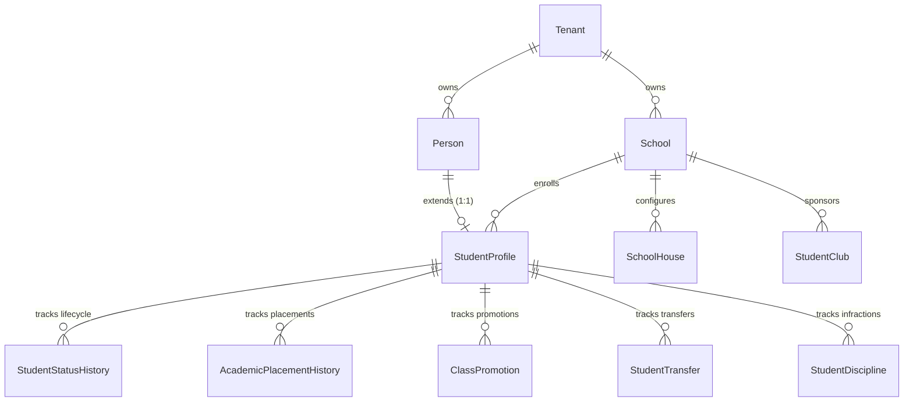

# EduOrbit ERP v1.2.0 — Student Information System (SIS) Architecture & Design Specification

> **Document ID**: `EDU-SIS-ARCH-v1.2.0`  
> **Release Target**: `v1.2.0-SIS`  
> **Architecture Level**: Enterprise Domain Architecture & Database Design Specification

---

## 1. Executive Architecture Summary

The **Student Information System (SIS)** forms the core academic domain of **EduOrbit ERP v1.2.0**. It manages master student identity profiles, guardian contacts, admissions processing, student ID generation, academic class placements, promotion workflows, inter-school transfers, disciplinary infractions, and graduation into alumni records.

Designed under Clean Architecture principles, SIS relies on shared Core Platform infrastructure (`backend/apps/core/`) for multi-tenant isolation, multi-channel notifications, feature flags, reporting engines, and transactional outbox event processing.

---

## 2. 6-Layer Clean Architecture

```
┌────────────────────────────────────────────────────────────────────────────────────────┐
│               EduOrbit SIS v1.2.0 Clean Architecture Layering                          │
└────────────────────────────────────────────────────────────────────────────────────────┘
  [Presentation / Web UI]   ──> HTMX + Alpine.js Student Portal & Admin Workstations
  [REST API Layer]          ──> DRF ViewSets (/students/api/v1/)
  [Service Layer]           ──> StudentLifecycleService, StudentNumberGeneratorService
  [Domain Model Layer]      ──> Person, StudentProfile, AcademicPlacementHistory, ClassPromotion
  [Infrastructure Layer]    ──> PostgreSQL 16 (Tenant Base), Redis 7, Celery Event Bus
```

---

## 3. Entity-Relationship Diagram (ERD)



---

## 4. Student Lifecycle State Machine

```
 (Pending) ──> (Active) ──> (Suspended) ──> (Withdrawn) ──> (Graduated) ──> (Alumni) ──> (Archived)
     │            │             │               │               │
     └────────────┴─────────────┴───────────────┴───────────────┴──────────> (Archived)
```

- **States**: `pending` → `active` → `suspended` → `withdrawn` → `expelled` → `graduated` → `alumni` → `archived`.
- **Enforcement**: Defined in `backend/apps/students/models.py` (`STUDENT_LIFECYCLE_TRANSITIONS`) and executed via `StudentLifecycleService.transition_student_status()`.

---

## 5. Service Layer Design (`backend/apps/students/services/`)

1. **`StudentNumberGeneratorService`** (`student_number.py`):
   - Pattern-based sequence generator: `STU-{YEAR}-{SEQ:5}` (e.g. `STU-2026-00001`).
2. **`StudentLifecycleService`** (`lifecycle.py`):
   - State transition validation and chronological logging (`StudentStatusHistory`).
3. **`StudentPlacementService`** (`placement.py`):
   - Versioned class and arm placement logging (`AcademicPlacementHistory`).

---

## 6. RBAC & Permission Matrix

| Role Code | Role Name | View Student Roster | Enroll Student | Promote Class | Issue Discipline | View Alumni |
| :--- | :--- | :---: | :---: | :---: | :---: | :---: |
| `school_admin` | Principal / Registrar | Full Control | Full Control | Full Control | Full Control | Full Control |
| `teacher` | Class Teacher | Assigned Class | `NO` | Recommend | View / Log | `NO` |
| `parent` | Guardian | Ward Only | `NO` | `NO` | View Ward | `NO` |
| `student` | Student | Self Profile | `NO` | `NO` | Self View | Self Only |

---

## 7. REST API Specification (`/students/api/v1/`)

- `GET /students/api/v1/students/`: List student profiles (Tenant filtered).
- `POST /students/api/v1/students/enroll/`: Enroll new student.
- `POST /students/api/v1/students/<id>/transition/`: Execute status transition (`pending` -> `active`).
- `POST /students/api/v1/students/<id>/promote/`: Execute class promotion.
